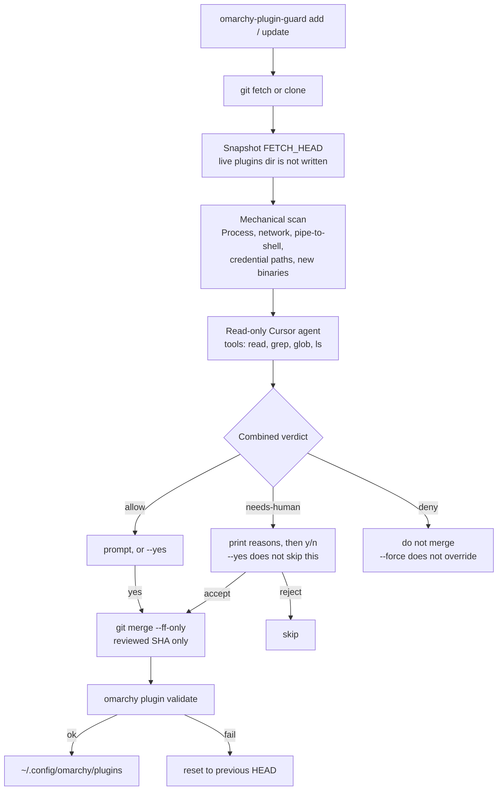

# omarchy-plugin-guard



Omarchy shell plugins are unsandboxed QML inside the long-lived `omarchy-shell` process. `omarchy plugin validate` only checks the manifest. This CLI reviews the **incoming git commit** and merges **that SHA only** — it never fetches again after the review.

This is a command-line tool, not an Omarchy bar plugin. Install it with pip, then use it instead of `omarchy plugin add` / `omarchy plugin update`.

## How it works

1. **Fetch** — `git fetch` only. The live tree under `~/.config/omarchy/plugins` stays untouched.
2. **Scan** — snapshot `FETCH_HEAD` and look for Process/exec, network, credential paths, pipe-to-shell, new binaries. Compare capabilities to the previous commit and a stored baseline.
3. **Agent** — a local Cursor agent sees the diff with read/grep/glob/ls only. No shell, no edits, no executing plugin code.
4. **Human** — three outcomes:
   - **ALLOW** — clean delta, agent agreed, no new capabilities. Confirm, or `--yes`.
   - **NEEDS HUMAN** — new Process/network/binary, first install, or the agent is unsure. Prints **NEEDS HUMAN REVIEW** and the reasons, then asks accept or deny. `--yes` will not skip this; `--force` will.
   - **DENY** — pipe-to-shell, credential-path hits, agent deny, or agent failure. Prints **DENIED — will not apply**. Never merges. `--force` does not override.
5. **Merge** — fast-forward the reviewed SHA, then `omarchy plugin validate`. A later commit that landed on GitHub during the review is not pulled in.

## Install

```bash
git clone https://github.com/yelenkovsky/omarchy-plugin-guard.git
cd omarchy-plugin-guard
python3 -m venv .venv
.venv/bin/pip install -e .
ln -sf "$PWD/.venv/bin/omarchy-plugin-guard" ~/.local/bin/omarchy-plugin-guard
```

Requires Python 3.11+. Agent review needs a Cursor user API key ([Dashboard → Integrations](https://cursor.com/dashboard/integrations)):

```bash
export CURSOR_API_KEY=cursor_...
# optional; default is composer-2.5
export CURSOR_MODEL=composer-2.5
```

Mechanical scan still runs with `--skip-agent` (that path always ends **needs-human**, never auto-applies).

## First run

Record what is already installed, then stop using raw `omarchy plugin update`:

```bash
omarchy-plugin-guard baseline --write
omarchy-plugin-guard status
omarchy-plugin-guard update --dry-run
omarchy-plugin-guard update
omarchy-plugin-guard add https://github.com/example/omarchy-weather.git --enable
```

`--yes` auto-confirms **allow** only. `--force` also applies **needs-human**. Nothing applies a **deny**.

## Commands

```text
omarchy-plugin-guard status
omarchy-plugin-guard baseline --write
omarchy-plugin-guard review [--json]
omarchy-plugin-guard update [id] [--dry-run] [--yes] [--force] [--skip-agent] [--json]
omarchy-plugin-guard add <git-url> [--enable] [--dry-run] [--force]
```

Exit codes: `0` ok / up to date / applied, `1` hard error, `2` denied or skipped.

State: `~/.config/omarchy/plugin-guard/` (`baselines/`, `reviews/`).

## License

MIT
